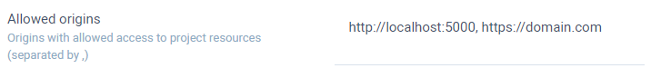

# Creating a web app

If you are creating a web app or making a request from a website, please make sure to check the information provided below.

## CORS mechanism


**Important.** Without doing this, requests from the browser will be blocked.


In case you are making requests to CodeMash from a browser, you will need to setup allowed origins in your project settings.

### Setting up allowed origins

* Go to your project settings
* Find a setting called **Allowed origins**.
* Add all allowed domains separated by comma \(,\).

