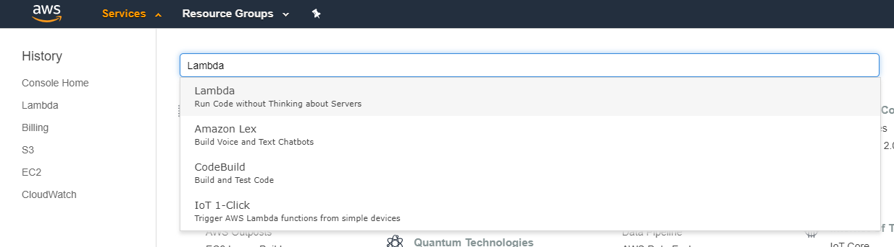
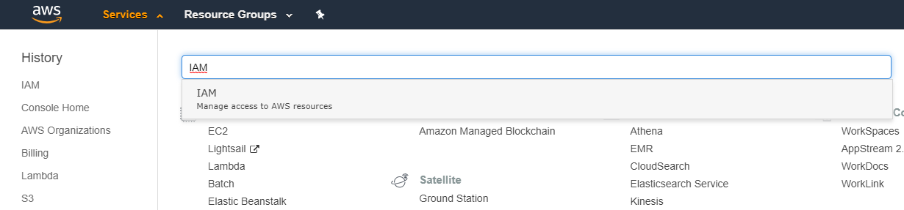
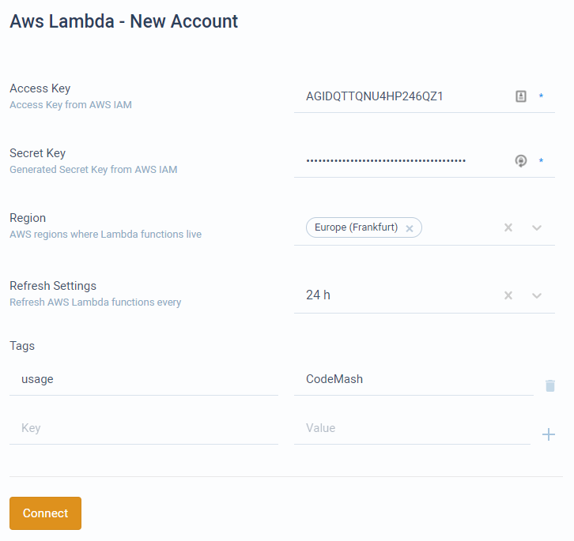

# Connect AWS Lambda

The following steps show how to connect the AWS Lambda account to CodeMash. The steps consist of:

1. Creating an AWS account.
2. Adding function execution role \(attaching to functions\).
3. Adding function invocation role \(attaching to API user\).
4. Connecting account into the CodeMash project.

## Creating AWS account

If you already have an AWS account, skip this section.

* Go to [https://aws.amazon.com/lambda/](https://aws.amazon.com/lambda/) and create an AWS account.
* After you create your account, log in to the [AWS management console](https://console.aws.amazon.com).

## Creating the first function

If you already have your functions ready, skip this section.

* From the management console, select **Services** from the menu bar and search for **Lambda**.

* In the opened functions list, press **Create function**.
* Here select **Author from scratch** set any **Function name** and select **Runtime**. Below expand the **Permissions** section. Here you need to select a role with which to execute a function. Preferably you want to select a **Use an existing role** option and create a role that you can later apply to your other functions. To create a new role, press the **IAM console** link provided near the options.
* Creating a role. The following steps lead to the role creation process.
  * For **Select type of trusted entity** select **AWS service**. For use case, select **Lambda**.
  * For permission, at least select the **AWSLambdaBasicExecutionRole** policy. This will allow you to execute your function. You can select other policies, like **AWSLambdaExecute** which would allow access to S3 service.
  * Finish role creation.
* Now back in function creation page, refresh existing roles, and select your created role.

## Adding API user

If you already have your user with access and secret keys, skip this section.

* From the management console, select **Services** from the menu bar and search for **IAM**.

* In the IAM management console, open the **Users** tab and press **Add User**.
* The following steps lead to user creation.
  * **Step 1.** For username set any username you like, for example, codemash\_api. For **Access type** select  **Programmatic access**.
  * **Step 2.** Set permission. You can create a group or attach existing policies directly. The policies that you want to attach are - **AWSLambdaReadOnlyAccess** and **AWSLambdaRole**. That allows us to get your functions and save them in your CodeMash project. The second role allows us to invoke your function from CodeMash.
  * The following step \(tags\) are optional and not used by CodeMash.
  * After the user has been successfully created, you will get its credentials - **access key** and **secret key**. Copy these. You can add more keys later from the user dashboard.

## Adding API credentials to CodeMash

Once you have a user to invoke your functions, use it's **access key** and **secret key** when adding an AWS Lambda account in CodeMash.

* To get the keys, go to the IAM management console \(image above _Selecting IAM service_\), open the **Users** tab, and select your user with programmatic access. Make sure, that your user has **AWSLambdaReadOnlyAccess** and **AWSLambdaRole** permissions.
* Open **Security credentials** tab. Hereunder **Access keys** create new access key if you don't have valid access, secret key pair.
* Now go to CodeMash project dashboard and navigate to Code &gt; Account &gt; Add New &gt; AWS Lambda.
* Fill the fields. Example with filled details shown below.
  * **Access Key** - your API user access key.
  * **Secret Key** - your API user secret key.
  * **Region** - all the regions from which you want to get your functions.
  * **Refresh Settings** - in case you are developing your functions and don't want to refresh them manually \(to show up in CodeMash\), you can automatically refresh at certain intervals.
  * **Tags** - function tags. Only those functions that have at least 1 of the tag will be imported into CodeMash. If no tags are added, then all functions will be imported.

* After connecting, your functions will appear in the functions tab. This process might take a few moments to receive all functions from AWS services.

