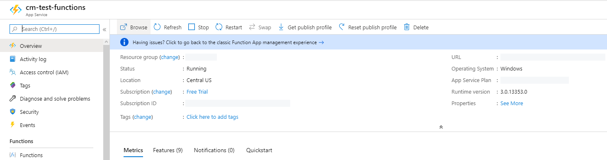
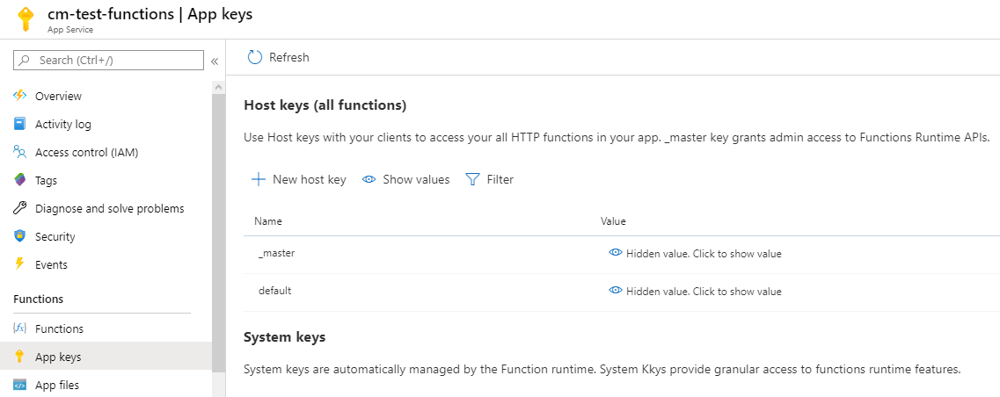
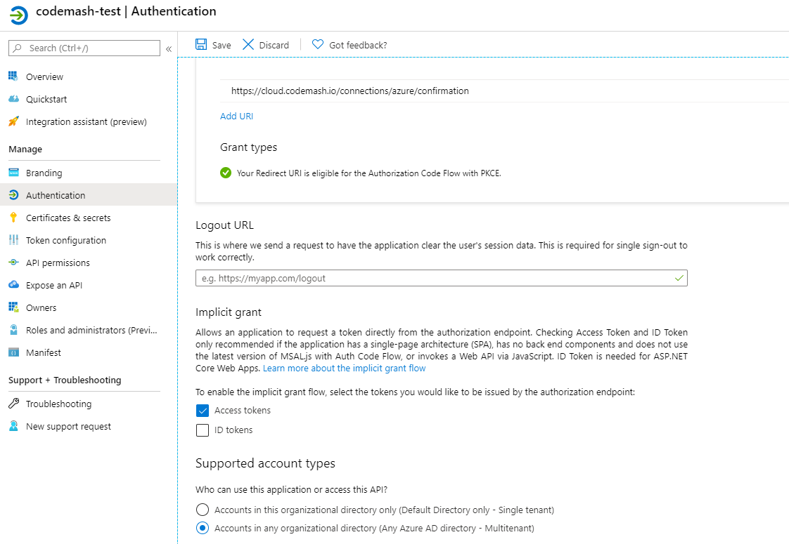
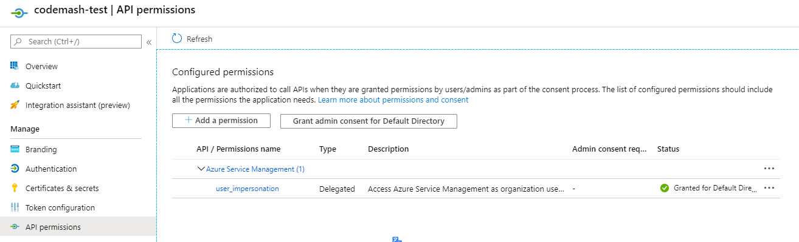
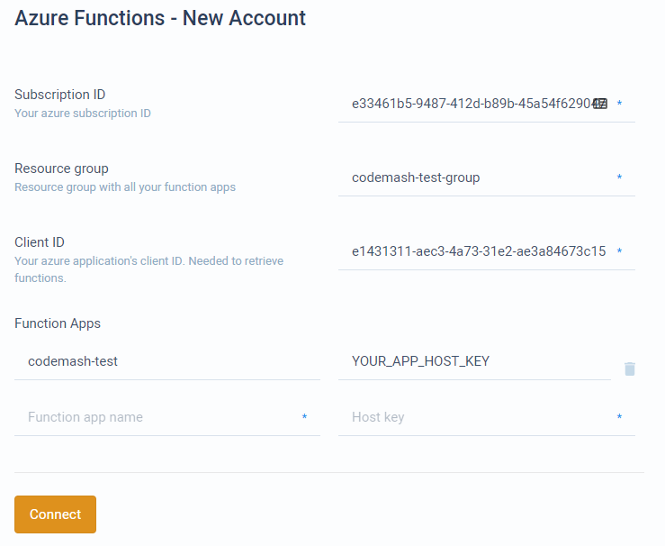

# Connect Azure Functions

The following steps shows how to connect Azure Functions account to CodeMash. The steps consists of:

1. Setting up Azure account.
2. Creating function apps.
3. Creating Azure Active Directory app.
4. Connecting account in CodeMash project.

## Setting up Microsoft Azure account

If you already have Microsoft Azure Functions app ready to use, skip this section.

* Go to [https://azure.microsoft.com/en-us/features/azure-portal/](https://azure.microsoft.com/en-us/features/azure-portal/) and sign in with your Microsoft account.
* Now open sidebar menu and navigate to **Create a resource**. Then select **Function App**. Here you might see different options if you haven't set up this yet.
  * If you are eligible for free trial, sign up for free trial.
  * If you are not eligible for free trial, you will have to add billing.

## Creating first function

If you already have your functions ready, skip this section.

* From management console, open sidebar menu and select **Create a resource**.
* In the opened page, select **Function App**.
* Creating a function app. The following steps lead through function app creation process.
  * Select your azure **Subscription** and **Resource Group**. Create new resource group if you want.
  * Select any available app name, for **Publish** select **Code**, then any runtime and region. Later you will be able to add more function apps under the same resource group but with different region and runtime.
  * For hosting, monitoring and tags choose whatever you like.
* Once function app deployment is finished, go to resource and you should see something like this.

* Select **Functions** from sidebar menu. Then press **Add**.
* Select **HTTP trigger** as a function template. In details select **Function** for **Authorization level**.

## Function authentication

Function calls from CodeMash are authenticated using **Host** key. To get or create a new key go to your function app dashboard and select **App keys** from sidebar menu.

## Adding AAD authentication


Do not skip this section. This is required to get your functions from Microsoft.


This authentication is required to get your functions from Microsoft API.

* Navigate to **Azure Active Directory** from expandable sidebar menu.
* Then navigate to **App registrations** from sidebar menu.
* Select **New registration**. Here give any name, for supported account types select second option - **Accounts in any organizational directory \(Any Azure AD directory - Multitenant\)**.
* For redirect URI select **Single-page application \(SPA\)** and write this URI \(without quotes\) "https://cloud.codemash.io/connections/azure/confirmation".
* Once app is created, navigate to **Authentication** from sidebar menu.
* Here scroll down and select **Access tokens** under **Implicit grant** and save.

* Now from the same sidebar menu go to **API permissions**. Here press **Add a permission** and select **Azure Service Management**. Now select **user\_impersonation** permission. Then press **Grant admin consent**. 
* Once done, API permissions page should look something like the following image.

## Adding API credentials to CodeMash

Once you have your function apps and authentication ready, you can add Azure Functions account in CodeMash.

* Go to CodeMash project dashboard and navigate to Code &gt; Account &gt; Add New &gt; Azure Functions.
* Fill the fields. Example with filled details shown below.
  * **Subscription ID** - your subscription ID. Can be found in function app overview page.
  * **Resource group** - resource group in which you created your function app. Can be found in function app overview page.
  * **Client ID** - your AAD authentication application ID. Can be found in AAD application \(created in the section above\).
  * **Function Apps** - functions apps that you want to add. You can add multiple function apps, but they all have to be in the same resource group. Here specify function app name and a host key for that app. Where to find host keys check [here](connect-azure-functions.md#function-authentication).

* After pressing connect, you will be redirected to login with Microsoft. Login with your Microsoft Azure account. This will allow us to get your functions from Microsoft.
* After connecting, your functions will appear in functions tab. This process might take a few moments to receive all functions from Microsoft services.

