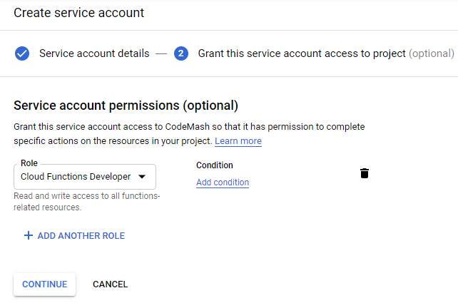
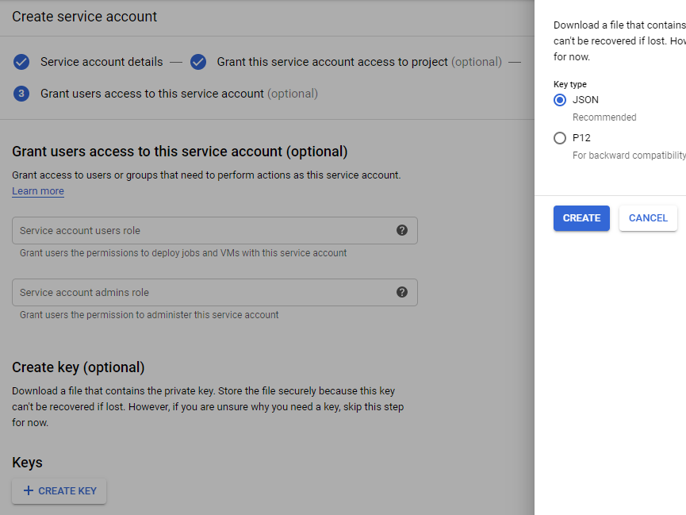
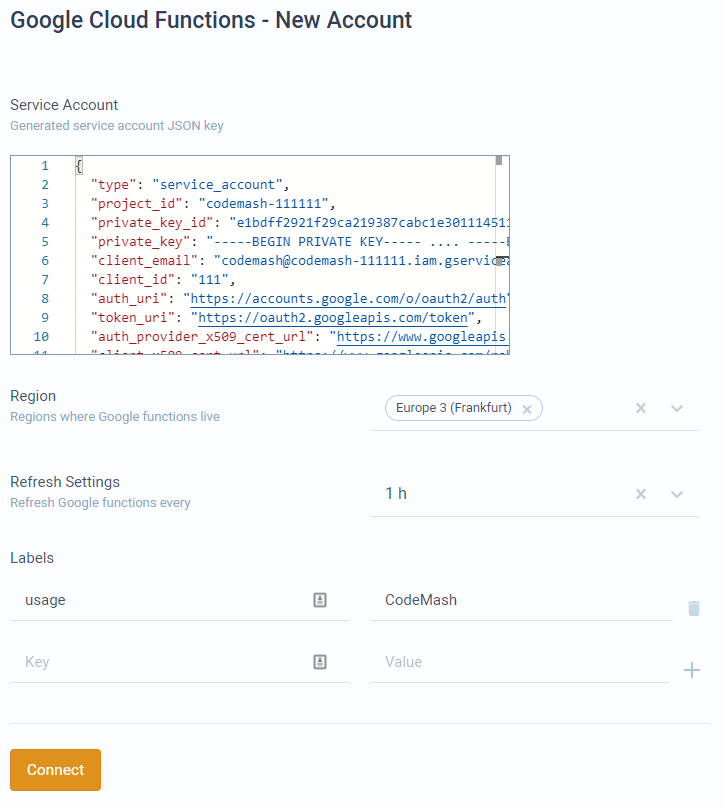

# Connect Google Functions

The following steps shows how to connect Google Cloud Functions account to CodeMash. The steps consists of:

1. Setting up Google Cloud account.
2. Creating service account.
3. Connecting account in CodeMash project.

## Setting up Google Cloud account

If you already have Google Cloud Functions account ready to use, skip this section.

* Go to [https://cloud.google.com/](https://cloud.google.com/) and login to console with your Google account.
* Select a project from your project menu or create a new one.
* Now open sidebar menu and navigate to **Cloud Functions**. Here you might see different options if you haven't set up this yet.
  * If you are eligible for free trial, sign up for free trial.
  * If you are not eligible for free trial, you will have to add billing account.

## Creating first function

If you already have your functions ready, skip this section.

* From management console, open sidebar menu and select **Cloud Functions**.
* In the opened functions list, press **Create Function**.
* Creating a function. The following steps lead through function creation process.
  * Set any name, and memory. For **Trigger** use **HTTP**.
  * For **Authentication**, it's recommended to not allow unauthenticated invocations. All of the calls from CodeMash will be authenticated.
  * Then select the runtime and edit your code if you want. You will be able to edit it later.
  * In advanced settings you will see service account selection. Google Cloud should have created a service account for you, so you can use that or you can check [_Adding Google service account_](connect-google-functions.md#adding-google-service-account) on how to add service account. This setting isn't important for CodeMash, so you can leave it how it is.

## Adding Google service account

If you already have your service account set up, skip this section.

* Service account will allow CodeMash to call Google Functions. Firstly navigate to [https://console.developers.google.com/](https://console.developers.google.com/) and select the project. Project should be the same as in your Google Cloud Platform.'
* Navigate to **Credentials** from sidebar menu.
* Here under **Service Account** section you might see existing service account created by Google Cloud. You can use that, in which case, go to last section. To create a new one press **Manage service accounts** and then **Create Service Account**.
* Set account name and press create. The following steps are NOT optional. You need to grant a few permissions. The minimum required permissions are **Cloud Functions Developer** or **Cloud Functions Admin**.

* In the final step, you can create a key to use from CodeMash. Press **Create Key** and select key type as JSON. A download will start with a JSON file key.

## Adding API credentials to CodeMash

Once you have a service account to invoke your functions, use it's JSON file key when adding Google Cloud Functions account in CodeMash.

* If you have skipped previous section, to get the file key, go to google developer console, select your project and select **Credentials**. Here under **Service Accounts** section, select service account which you want to use for CodeMash. Your service account needs at minimum one of these permissions: **Cloud Functions Developer** or **Cloud Functions Admin**. You can check and manage permissions by navigating to **IAM & Admin &gt; IAM** from sidebar menu. Then in service account details page select **Create Key**. After that select JSON as key type. You will receive your key.
* Once you have your JSON file with a private key, go to CodeMash project dashboard and navigate to Code &gt; Account &gt; Add New &gt; Google Cloud Functions.
* Fill the fields. Example with filled details shown below.
  * **Service Account** - contents of your JSON file key.
  * **Region** - all the regions from which you want to get your functions from.
  * **Refresh Settings** - in case you are developing your functions and don't want to refresh them manually \(to show up in CodeMash\), you can automatically refresh at certain intervals.
  * **Labels** - function labels. Only those functions that have at least 1 of the label will be imported into CodeMash. If no labels are added, then all functions will be imported.

* After connecting, your functions will appear in functions tab. This process might take a few moments to receive all functions from Google services.

