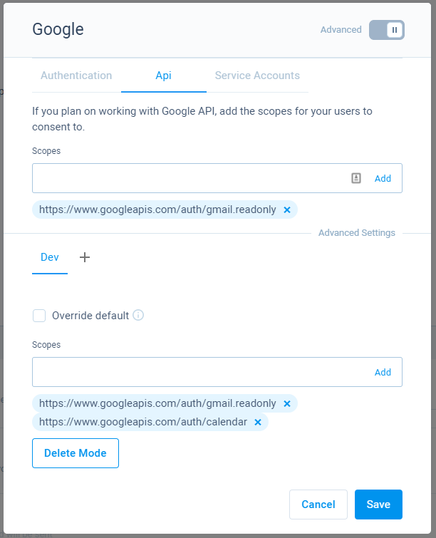
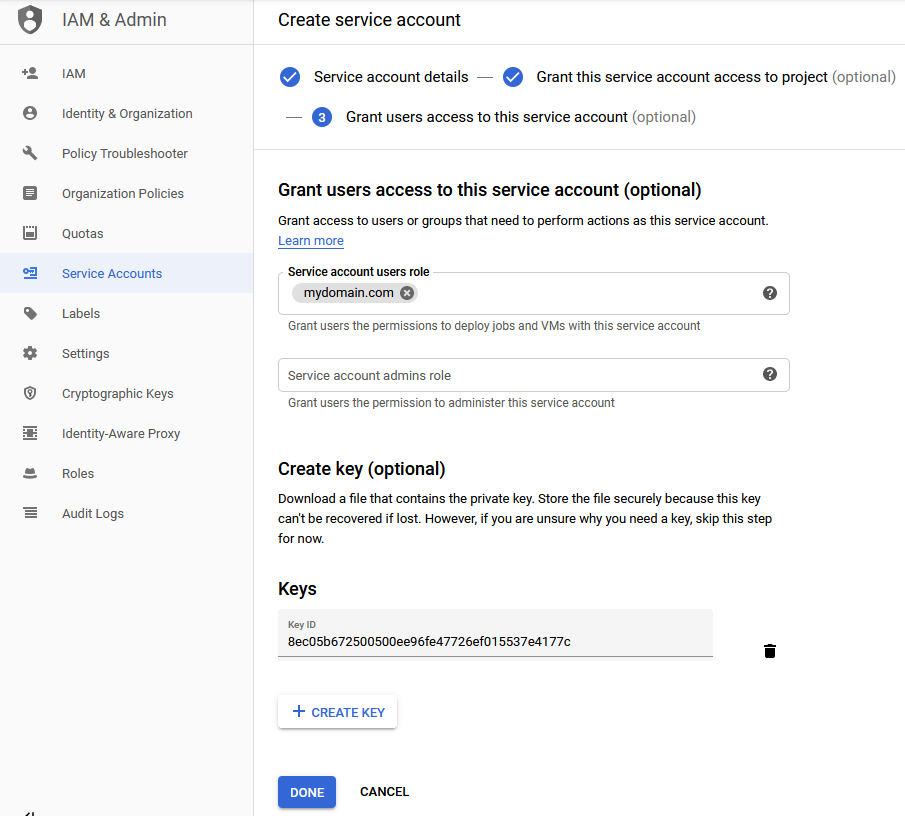

# Google Functions

Google provided API services implemented in **CodeMash**. These functions allow to easily integrate Google provided services, like calendar and GMail, into **CodeMash**.

## API implementations

The following are implemented Google resource functions.





## User authentication

To be able to use these functions, enable Google authentication in Membership settings. Check how to do that by going to a page below.



## API authentication

To use these functions you will need to enable Google authentication in your membership settings. Then you will have to add scopes that you want your users to consent to during the login process.

Here we have two fields for scopes, the upper one is treated as a default, the second one is for **Dev** mode. The default scopes are always used unless **Override default** is checked and mode is passed during the authentication process. This could be helpful if you are developing your application further and want to add more scopes in a development environment without changing production. 

### Service accounts

If you are using G Suite or Google Groups, you can use service accounts to use Google services. The following shows how to setup G Suite to work with CodeMash.

#### Setting up G Suite

* Go to [Google developers console](https://console.developers.google.com) and login with your Google \(or G Suite\) account.
* Once logged in, create a new project if haven't created yet during the authentication setup.
* Navigate to **Credentials** and click **Create Credentials**. Select **Service account**.
* Set the name and create. Proceed to the next steps.
* In the third step, **Grant users access to this service account**, in field **Service account users role**, set your G Suite domain. Another field is not required.
* After that, create a JSON key and click done.

* After that is done, navigate to [G Suite](https://gsuite.google.com/) admin console.
* From the admin console home page navigate to **Security &gt; API Permissions &gt; Manage Domain Wide Delegation**. Here click **Add New**.
* Here **Client ID** will be the ID of your created service account. Go back to the **developers console** and open service account details. Copy value under the **Unique ID** field.
* For scopes, you can get all the scopes from [G Suite API](https://developers.google.com/gsuite/aspects/apis). In the documentation select the APIs you want. Then select references from the top menu, and you will find scopes near each HTTP request.

The only thing that's left - adding created service account to CodeMash.

* Once again, navigate to the **developers console** and open created service account details. If you haven't created the JSON key yet, then create it. Else if you already have a file, proceed to the next step.
* Go to CodeMash project membership settings, select Google authentication, and open service accounts tab.
* Here add service account.
* For name, set any name. For scopes, set the same scopes as they are in G Suite. For service JSON key, paste the downloaded file content.

Now you can use your service account in Google functions.

## External references

As all of these functions uses Google API, you will find all of the details in the official documentation:

* [Google API references](https://developers.google.com/gsuite/aspects/apis)

