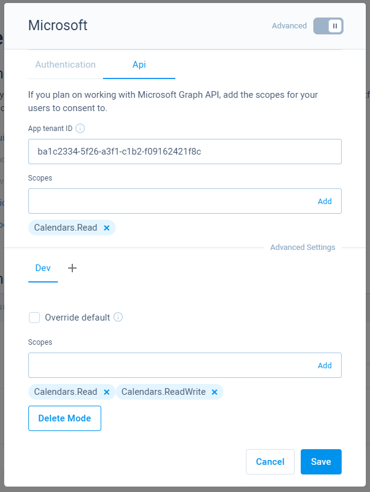
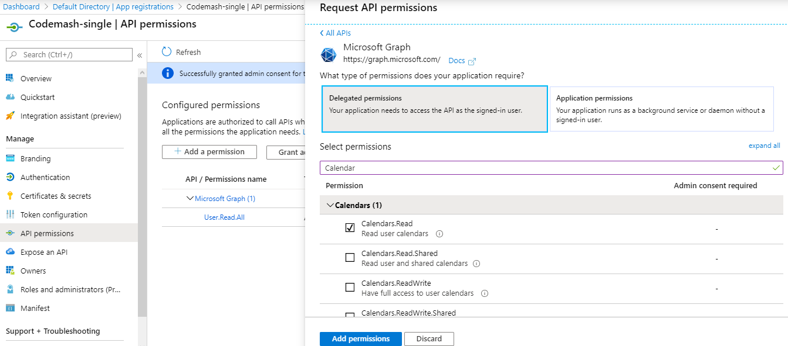
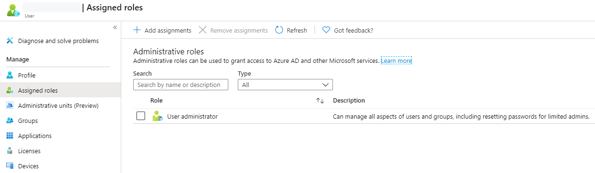
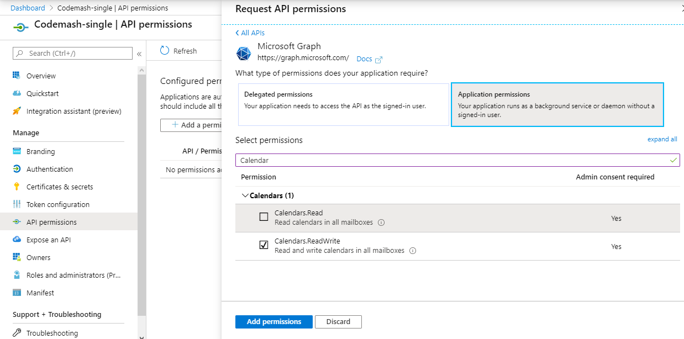

# Microsoft Functions

Microsoft Graph provided API services implemented in CodeMash. These functions allow to easily integrate Microsoft Graph provided services, like calendar and users, into CodeMash.

## API implementations

The following are implemented Microsoft Graph resource functions.





## User authentication

To be able to use these functions, first Microsoft authentication needs to be enabled in Membership settings. Check how to do that by going to a page below.



## API authentication

To use these functions you will need to enable Azure Active Directory authentication in your membership settings. Then you will have to add scopes that you want your users to consent to during the login process. Note, that here you add **Delegated** permissions and not **Application** permissions. More on that below.

Here we have two fields for scopes, the upper one is default, the second one is for **Dev** mode. The default scopes are always used unless **Override default** is checked and mode is passed during the authentication process. This could be helpful if you are developing your application further and want to add more scopes in a development environment without changing production. 

For application permissions, you must add an **App tenant ID**. The difference between this tenant ID and the one in the authentication tab is that in authentication tab, tenant can have other values when using multi-tenancy. This ID though must be an actual GUID of your Azure directory where your app is.

### Delegated permissions

These are the permissions that the user has to consent to during the authentication process. They belong to **work**, **school,** and **personal** Microsoft accounts. You will have to add these permissions in Azure portal and in CodeMash. Grant them admin consent if required.


These permissions can also be used in background, without user by using a refresh token. CodeMash automatically renews refresh tokens so that they don't expire.

This could still cause problems, if you add new scopes, users might have to go through Microsoft authentication flow to consent to new scopes.


In addition, some permissions will require user to have appropriate roles in Azure portal \(otherwise **Authorization\_RequestDenied** error will be returned\). You can assign roles to a user from user management page.

### Application permissions

These are the permissions that the server uses to call Microsoft API. You do not add these permissions in CodeMash. They need to be added and consented in Azure portal.


**Application access token** is cached and reused until expiration. If you update permissions in Azure, then you will have to go to Code service settings and clear **Microsoft functions cache**.


## Errors

The following are some of the possible errors that can be expected in return.

| Error code | Description |
| :--- | :--- |
| Authorization\_RequestDenied | Returned in response data. Insufficient privileges to complete the operation. Check if required scope is added in Azure portal and consented. If using delegated permissions, check if user has required role. |
| Authorization\_IdentityNotFound | Returned in response data. The identity of the calling application could not be established. Make sure that you set tenant ID in membership Microsoft API settings. |
| RefreshTokenInvalid | Returned in error response. This means that server could not get a valid access token to Microsoft resources. User needs to go through authentication flow again. |
| ScopeInvalid | Returned in error response. This means that currently signed in user has not consented to the required scope and needs to go through authentication flow again. |
| TenantNotFound | Returned in error response. This means that your provided tenant ID in membership settings, Microsoft API settings, is invalid. |

## External references

As all of these functions uses Microsoft Graph API, you will find all of the details in the official documentation:

* [Microsoft Graph documentation](https://docs.microsoft.com/en-us/graph/api/overview?view=graph-rest-1.0)

