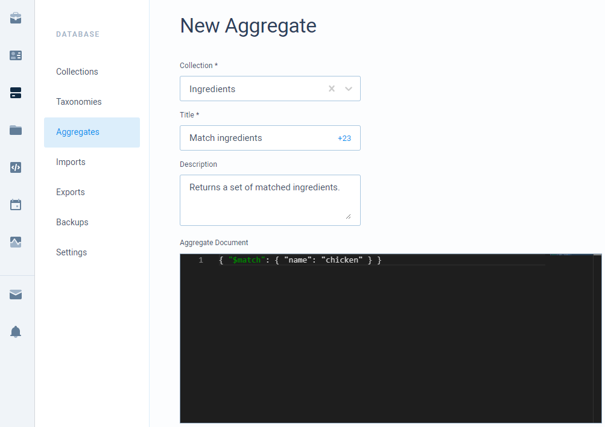

# Aggregation

Aggregation allows us to use complex logic on your records and return the processed result. This is essentially a **Find** method but instead of returning your records as they are, you can return completely different data forms of data.

## Creating aggregates

As aggregate documents can be quite big in size and very troublesome to pass in a request, we provide an ability to create an aggregate document in a dashboard and only pass the ID of an aggregate.



Here you provide a base collection that this aggregate will be run on. Collection can't be changed after creating an aggregate. Also, you provide some title and optionally a description. The main field to provide - aggregate document. This defines all the aggregation pipeline that will be executed on your request.

## Aggregate document

Aggregate documents are made from an array of objects called stages. All of these stages process your records in some way and will be executed from top to bottom. For all available stages check the external resources. An example document is displayed below.

```javascript
{ "$match": { "age": { "$gt": 18 } } },
{ "$sort": { "age": -1 } },
{ "$project": { "age": 1, "name": 1 } }
```

Here we filter all the records leaving only those that have an age field greater than 18. Then we apply sort on those filtered records and finally, we use projection leaving only age and name fields \(\_id field is also included\) on each record. Of course, this is a very basic example. The logic can be much more complex.

## Tokens

As you might want to pass some dynamic data into your aggregates you can do that using tokens. Just write a token in your aggregate starting with **@Model** and then pass key-value pairs into [API](https://docs.codemash.io/sdks) request. The following shows an example of how to write tokens in the aggregate document.

```javascript
{ "$match": { "age": { "$gt": @Model.age }, "country": "@Model.address.country" } }
```

Then in your request pass the tokens parameter like this:

```javascript
{ 
    "age": "18",
    "address.country": "Eswatini"
}
```

Token values are strings so make sure that you properly write tokens in your aggregates. If it's supposed to not be a string, don't add quotes in your aggregate around the token. Else if it's a string, then put your token inside quotes.

More about token binding follow a link below.




Unlike in email or push notification templates, here you cannot use razor syntax. You are only allowed to add tokens without any additional processing.


## External references

As CodeMash is using MongoDB database internally, the following resources explain more on how to form aggregate documents.

* [Aggregation documentation](https://docs.mongodb.com/manual/aggregation/)
* [Aggregation pipeline stages](https://docs.mongodb.com/manual/reference/operator/aggregation-pipeline/#alphabetical-listing-of-stages)

