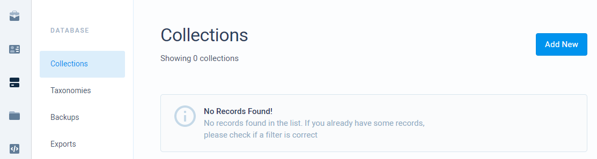
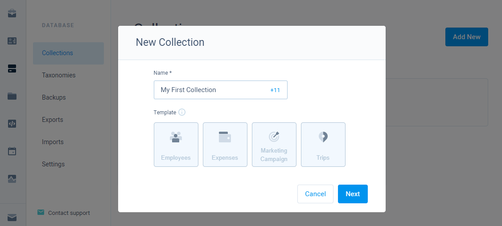
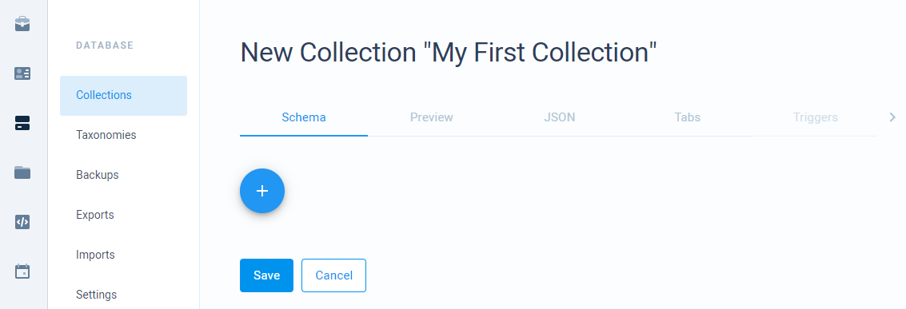
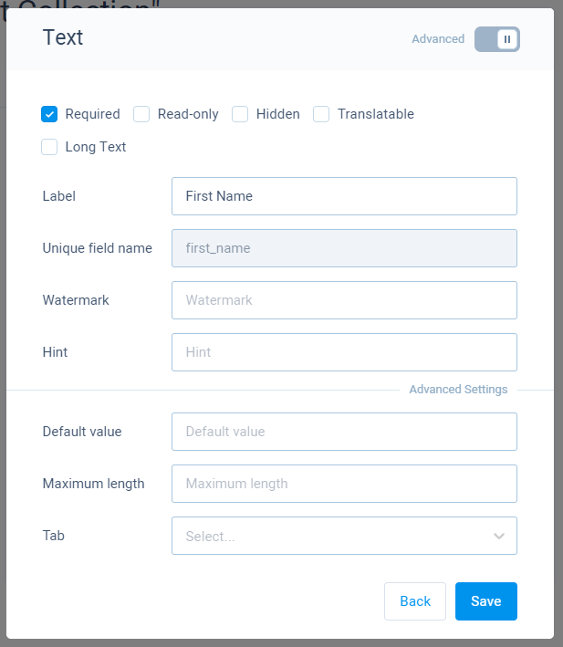

# Collections

The collection is a way to store your data inside the database. You can create new collections on our dashboard page where we provide an easy to use collection builder with various field types. Our builder is using JSON schema to store the structure of your collection so you can copy the schema and reuse it in creating other collections.

## Creating a collection

* Navigate to the collections list by selecting on **Database Module** from the left menu bar and then selecting **Collections** from a sub-menu.

* Press on **Add New** button and a new dialog window will show up where you set your collection name and can select a predefined template \(optional\) for your collection. Templates already include fields based on the theme of a template.

* After you have defined a name and optionally selected a template, press **Next,** and a collection builder will open.

* In the opened page you can see several tabs that allow you to configure your collection. Generally, you only need a schema builder to be able to add fields to your collection. You can also use a JSON view to manually edit your schema.
* To add a field, open the **Schema** tab and press a **+** button. A new dialog will show up where you can select a field.

* After selecting a field another dialog will show up and in there you have to provide information about the field.

* After you have configured a field, press **Save**. This will add a new field to your collection.
* When done adding fields, press **Save** inside of the **Schema** tab to save all added/updated fields.

## Collection configuration

The collection has many settings that you can configure. This is all accessible inside of a collection page which can be accessed during collection creation or by selecting a collection from the collections list.

1. **Schema** - allows you to manage your collection fields.
2. **Preview** - allows you to see how your fields will be rendered when adding records from a dashboard.
3. **JSON** - allows you to edit/copy your JSON and UI schemas manually. This is essentially what schema builder generates.
4. **Tabs** - shows all tabs used for your collection fields.
5. **Triggers** - allows you to manage triggers for this collection. _Not available during collection creation_.
6. **Indexes** - allow you to manage indexes for this collection. _Not available during collection creation_.

More about configuration settings:









## Collections API

Exposed API collection methods allow performing CRUD operations over your collections.



