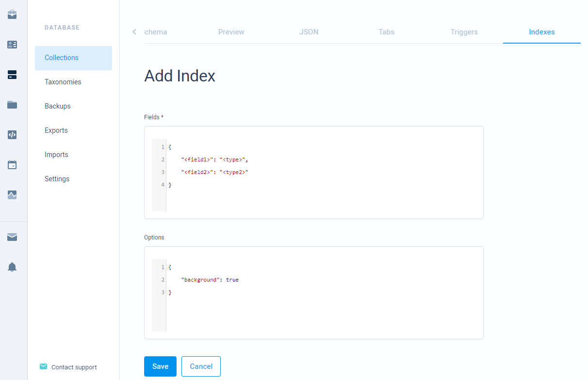

# Indexes

To optimize your find queries you can add indexes for your collection. Because we are using MongoDB internally as a provider, indexes should be set according to MongoDB standards.

## Creating indexes

Indexes can be added inside a collection page, **Indexes** tab. Here you need to provide fields with an index value. Optionally you can provide options for an index.



To create an index, modify provided **&lt;field&gt;** and **&lt;type&gt;** fields. The **&lt;field&gt;** is your field name \(unique name\) and **&lt;type&gt;** is an index value for that field. You can also specify some options. Though options currently are not fully supported so you can leave the options field as it is.


Indexes take up some available storage in your database. So don't overuse indexes if you are nearing your storage limit.

Also, indexes decrease performance when inserting, updating, deleting your records as the keys in the index needs to be adjusted. 


## Index Types

The following provides some available examples displaying various available options for your indexes.

### **Single field index**

Consists of one field. Here **&lt;field&gt;** is first\_name and **&lt;type&gt;** is **1**.

```javascript
{ "first_name": 1 }
```

### **Compound index**

Consists of multiple fields. Here we create an index on two fields. In this case **&lt;field&gt;** representations are **first\_name** and **age**, and **&lt;type&gt;** representations are **1** and **-1**.

```javascript
{ "first_name": 1, "age": -1 }
```

Here values **1** and **-1** tells how to sort index keys. For a single field the order does not matter. For compound, it matters when using sorting. It matters in two ways:

1. In a sort query, your fields must be **listed in the same order** as in index \(although you are not required to use all fields that are in the index, you can use a subset\). For example, if you call a find method and provide a sort query`{ first_name: 1, age: -1 }`then index will be used. But if you change positions like this`{ age: -1, first_name: 1 }`then your index will not be used.
2. In sort query your fields must **match the sort direction** as in index or must **match the inverse sort direction** . for example, if you call a find method and provide a sort query `{ first_name: 1, age: -1 }` or `{ first_name: -1, age: 1 }` then the index will be used. But if you only inverse one of the fields like`{ first_name: -1, age: -1 }`then the index will not be used. 

If you want to put indexes on nested forms, then you can do that separating nested field name and a field inside the nested field by a dot.

```javascript
{ "address.zip": 1 }
```

## External references

As CodeMash is heavily using MongoDB database internally, the following resources explain more on how to form indexes.

* [Full indexes manual](https://docs.mongodb.com/manual/indexes/)

