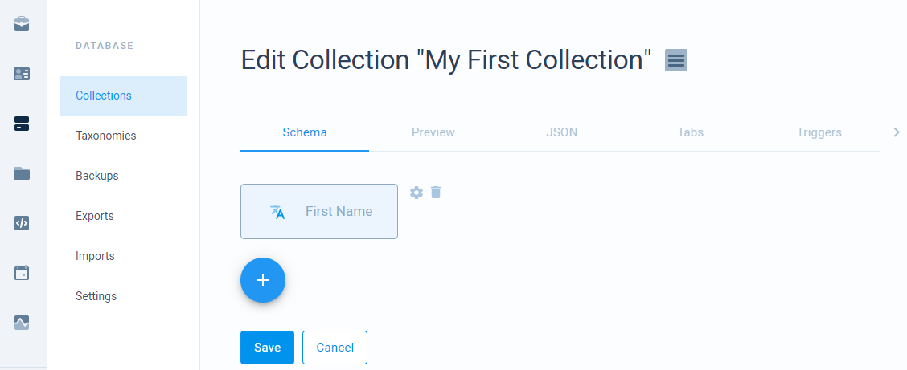
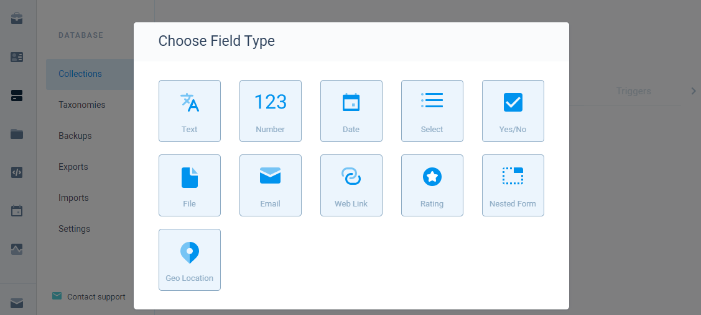
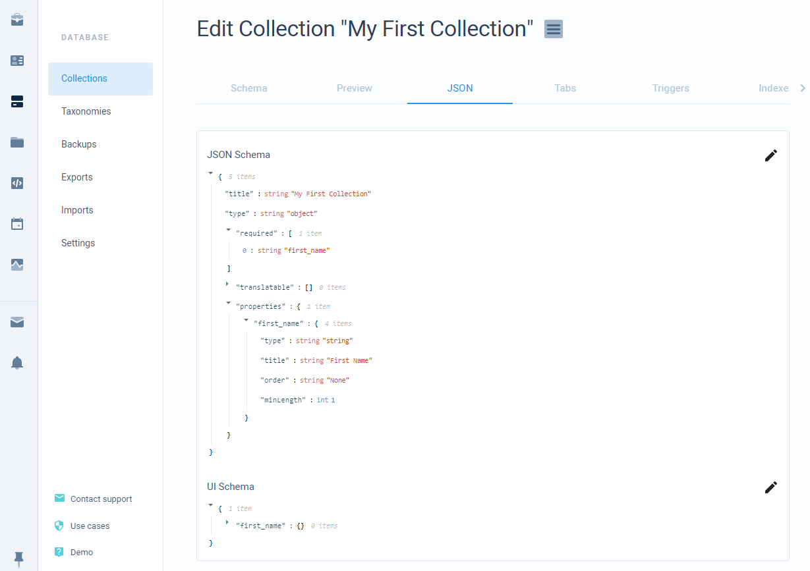

# Schema

Your collection fields internally are saved as JSON and UI schemas. We provide an easy to use schema builder where you can manage your fields without knowing anything about these schemas. We also provide an option to see and manually edit collection schemas which can be useful if you want to recreate a collection by copying a schema from one collection and pasting it to another.

## Schema builder

Schema builder allows you to add fields to your collection. The builder can be accessed by opening your collection or creating a new collection.

| Field Action | Description |
| :--- | :--- |
| Add | To **add** a field press a **+** icon. A new dialog will show up where you can select a type of field to add. |
| Edit | To **edit** a field press a **cog** icon near already added field. In this case that would be _First Name_ field. |
| Delete | To **delete** a field press a **trash** icon near already added field. In this case that would be _First Name_ field. |

### Field types

We provide many different field types that should satisfy any needs.

<table>
  <thead>
    <tr>
      <th style="text-align:left">Field</th>
      <th style="text-align:left">Description</th>
    </tr>
  </thead>
  <tbody>
    <tr>
      <td style="text-align:left">Text</td>
      <td style="text-align:left">
        
Text values.

        
This can be <b>basic text</b>, <b>long text</b> (multi-line basic text), <b>translatable text</b> (basic
          or long text with the ability to set for multiple languages), or <b>HTML</b>.

      </td>
    </tr>
    <tr>
      <td style="text-align:left">Number</td>
      <td style="text-align:left">
        
Numeric values.

        
This can be <b>integer</b>, <b>decimal, </b>or <b>currency</b>.

      </td>
    </tr>
    <tr>
      <td style="text-align:left">Date</td>
      <td style="text-align:left">
        
Date and time values.

        
This can be a <b>date</b> or <b>date and time</b>.

      </td>
    </tr>
    <tr>
      <td style="text-align:left">Select</td>
      <td style="text-align:left">
        
Value or values from a list. Used for static enumeration values or references
          to other resources.

        
This can be an <b>enumeration</b> (static values list), <b>user(s) reference</b>, <b>role(s) reference</b>, <b>collection reference</b>, <b>taxonomy reference</b>.

      </td>
    </tr>
    <tr>
      <td style="text-align:left">Yes/No</td>
      <td style="text-align:left">
        
Simple bool type value.

        
This can be <b>true</b> or <b>false</b>.

      </td>
    </tr>
    <tr>
      <td style="text-align:left">File</td>
      <td style="text-align:left">
        
File field. Requires files module to be enabled.

        
This can be of type <b>image</b>, <b>document, </b>or <b>any</b>.

      </td>
    </tr>
    <tr>
      <td style="text-align:left">Email</td>
      <td style="text-align:left">A special type of text field used for email addresses. Use this instead
        of the text field for email address validation and availability to send
        emails to addresses saved in this field.</td>
    </tr>
    <tr>
      <td style="text-align:left">Web Link</td>
      <td style="text-align:left">A special type of text field used for URLs. Use this instead of the text
        field for URL validation.</td>
    </tr>
    <tr>
      <td style="text-align:left">Rating</td>
      <td style="text-align:left">A special type of number field used for rating. Use this instead of the
        number field to display a rating selection in your record page and for
        rating validation.</td>
    </tr>
    <tr>
      <td style="text-align:left">Nested Form</td>
      <td style="text-align:left">
        
A list of objects. You can add any other field inside of the nested field.

        
<b>! Important</b> - only one nested level is supported.

        
<b>! Important</b> - nested form is provided as an array and not an object.

      </td>
    </tr>
    <tr>
      <td style="text-align:left">Geo Location</td>
      <td style="text-align:left">Latitude and longitude values.</td>
    </tr>
    <tr>
      <td style="text-align:left">Tags</td>
      <td style="text-align:left">A dynamic enumeration. Use this instead of the select field with enumerations,
        when you don&apos;t know all of the enumeration values from the start and
        want to add them on the go.</td>
    </tr>
  </tbody>
</table>

## JSON schema

As said before, schema builder uses JSON schema internally which you can see or edit yourself.

* **JSON schema** - a schema that describes each of a field. Used for validation and display.
* **UI schema** - a schema that describes how each field should be rendered.

Although we provide schemas and allow you to edit them, we still recommend using a builder as builder fields use specific values to form a schema. Besides, editing your fields in the builder will reset your changes in JSON and UI schemas. 


**UI schema** should not be edited at all \(unless you paste a schema previously generated by a builder\) because each of a field requires specific values to be rendered correctly.


