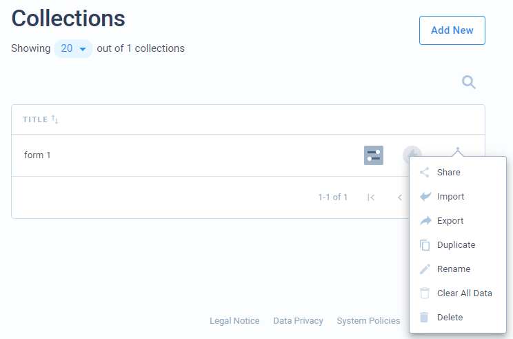

# Shared Forms

Shared forms allow your users and/or public guests to fill out your created collection forms.

## Creating a form

To create a form, first, create a collection with the fields that you want your users to fill out. After that, you can share your collection from the collections page.

## Authentication

Your forms can require authentication or can be open publicly. To authenticate users and allow them to enter data, you first need to setup authentications you want. How to do that, follow the link below.



For third-party authentication providers, you will have to add a **redirect URL** in provider settings. The following are the links for each affected provider.

* Microsoft - `https://hub.codemash.io/shared/forms/auth/aad`
* Google - `https://hub.codemash.io/shared/forms/auth/google`

