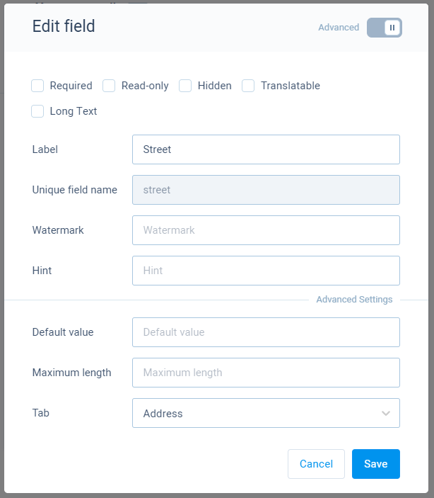
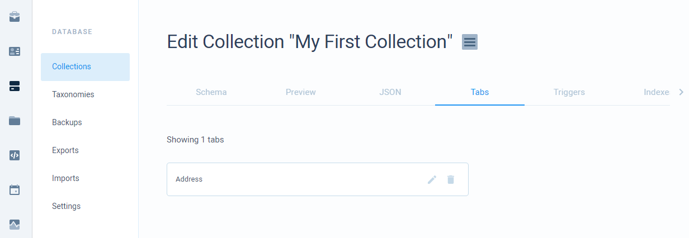
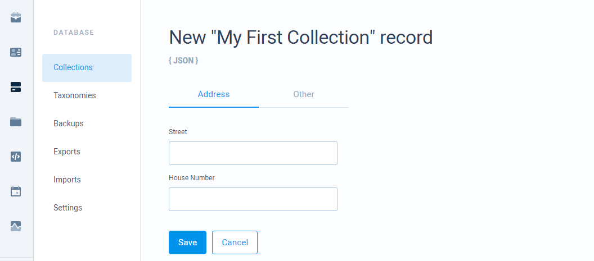

# Tabs

Tabs allow you to visually organize your fields. That means that tabs do not change data structure in any way, it only groups your fields together so that when viewing records through the dashboard, you can view these tabs separately.

## Managing tabs

You can create/select a tab inside field configuration dialog window under advanced option.

Once you have created a tab and saved a field, your tab is created and can be viewed inside **Tabs** tab in your collection page. There you can reorder, move and delete your tabs.

## Tabs in action

Your tabs can be seen in record page. Here fields under **Address tab** are shown together. Other fields will be in other tabs or a default tab **Other** if no tab for a field is selected. 

