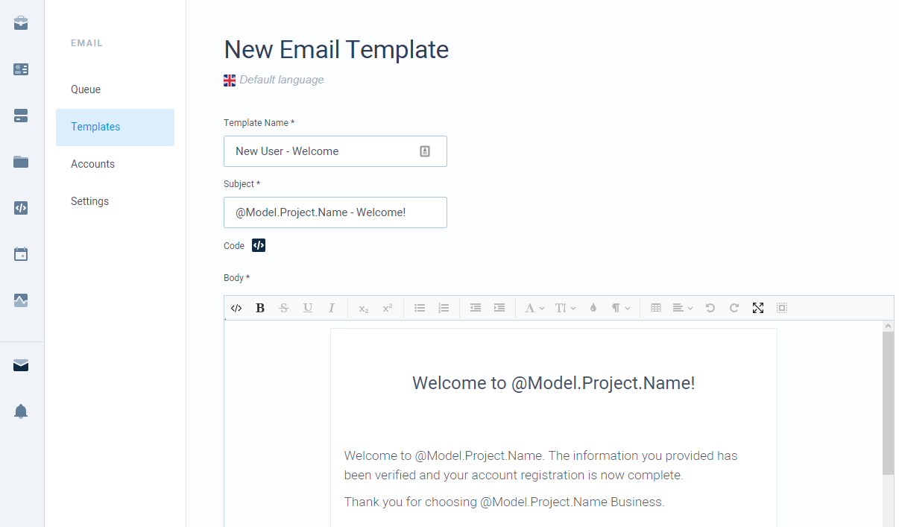

# Email Templates

Email templates lets you define the structure of your email messages.

## Creating a template

Navigate to email templates list by selecting on **Email Module** from the left menu bar and then selecting **Templates** from a sub-menu. Then press **Add New**.



Here you provide template name which is essentially a way to identify templates for yourself. Also a subject which is a subject for an email message and a body which is a body for an email message. Additionally you can provide code and email account to use for sending this template.


Body mode can be swapped between source \(html\) and editor modes. Shown above is an editor mode which displays how your message will look to a recipient. Change to source mode to edit html code.

Also everything written in source mode is considered to be inside html &lt;body&gt; tags. Though you can still use &lt;style&gt; tags.


## Tokens

To use dynamic data in your templates you can use a **@Model** object. This object will be injected with all of your tokens passed in send request and additionally some predefined tokens.

In the example above there is a token `Project.Name` used in multiple places. It is a predefined token which corresponds to your project's name. Before email is sent, this value will be replace with your project's name and instead `Welcome to @Model.Project.Name!` recipient will see something like `Welcome to CodeMash!` .

Writing tokens is supported in:

* Subject
* Code
* Body

If you wish to write some logic, you can do that in **Code** block. All the code you write in this block will be attached to your body, so you can use variables defined in code block inside your body. Although all of this code can also be written inside body block, it was just separated to distinct code from body.

#### Example of a code block

```javascript
@{
    var goodDecision = "Bad Decision";
    if (@Model.Favourite.Color == "purple") {
        goodDecision = "Good Decision";
    }
}
```

#### Example of the body block

```markup
This is a token directly injected into body: @Model.Direct.Token
This is a token from code block: @goodDecision

You can also write code in your body block:
@{
    var bodyVariable = @Model.Direct.Token;
}

And then use it just like variables from code: @bodyVariable
```


Tokens use **Razor** syntax. So your subject, code and body blocks must be a valid razor code.


More about how to use tokens follow the link below.



There are some already predefined functions that can be used to ease the use of tokens.



## Predefined functions

There are some built in functions that can be used to ease the use of tokens.

