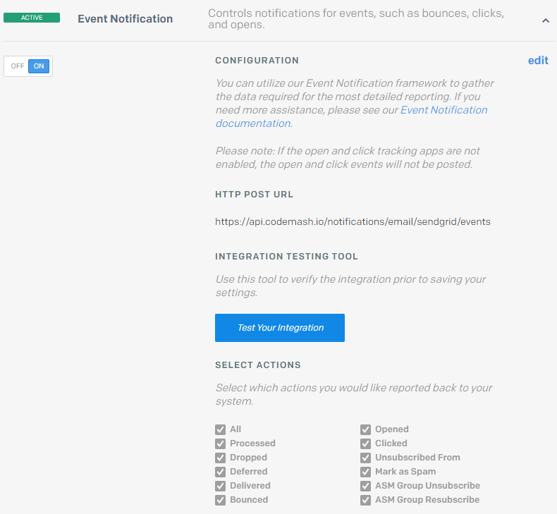

# Email Webhooks

Webhooks allow you to get more information on what happened with each email. Without setting up a webhook our system will only display whether your emails were sent to a provider or not. To know if emails reached their respective recipients if the recipients opened those emails, and more, you need to register a webhook.

All of our given email providers offer webhook functionality. The following shows how to set up webhooks using any of the providers.

## SendGrid

1. Sign-in to your SendGrid account.
2. Go to **Settings &gt; Mail Settings**.
3. Open **Event Notification** expandable.
4. Here make sure that the switch on the left is set to **ON**. In a field **HTTP POST URL** add the following URL **`https://api.codemash.io/notifications/email/sendgrid/events`**.
5. Below check the boxes of event types that you want to receive.


**Click** and **open** events will not be tracked just yet. For that, you need to enable open and click tracking.

1. Go to **Settings &gt; Tracking**.
2. Here expand **Click Tracking** and **Open Tracking** and switch them to **ON**.


