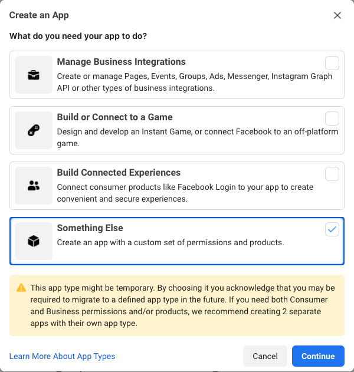
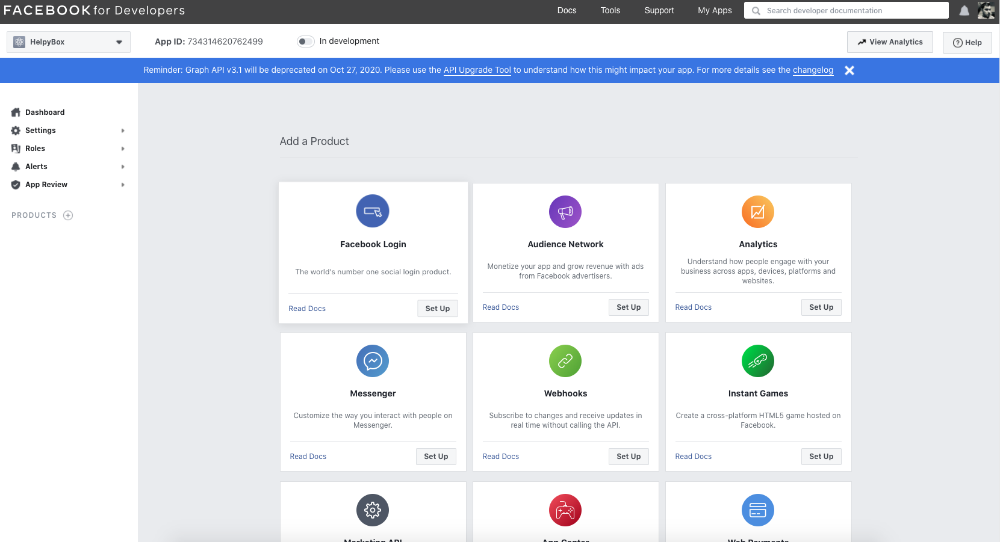
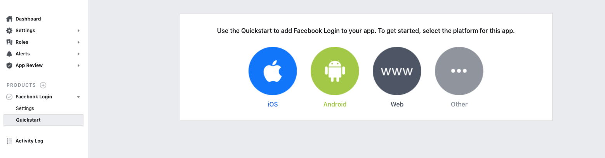
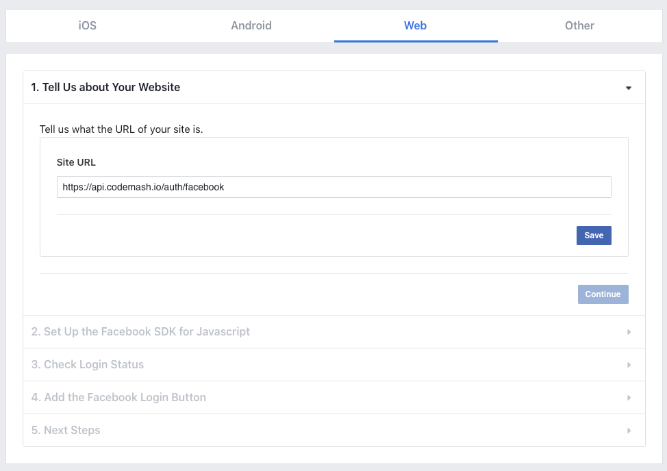
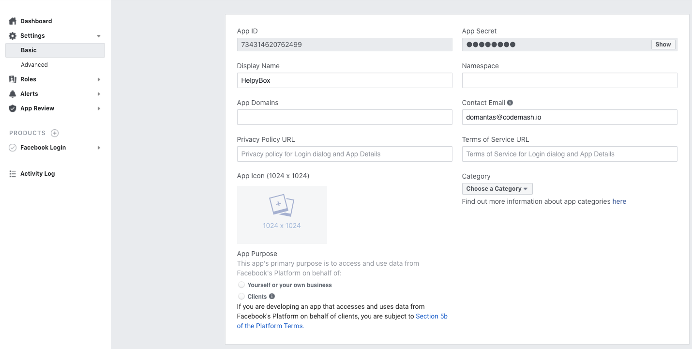

# Facebook Authentication

Authenticate your users using Facebook authentication service. This will allow users to connect to your CodeMash application using their Facebook accounts.

## 1. Creating Facebook project

You will need a Facebook project to connect to CodeMash.

* Go to [Facebook developers console](https://developers.facebook.com/) and login with your Facebook account.
* Once logged in, go ahead and press the "My Apps" menu link and press the button "Create App".
* Choose "**Something else**" from the following options.

* Choose **Facebook login** as it shown in the image below.

* Then choose **Web** 

* You will be asked to enter the **Site URL**, just enter [https://api.codemash.io/auth/facebook](https://api.codemash.io/auth/facebook) and ****press the **Save** button. Other wizard topics are not important and covered by CodeMash.  

* Press the **Settings -&gt; Basic** menu item under left side menu

* Copy **App ID** and **App Secret** and follow our instructions provided below. 

## 2. Connecting to CodeMash 

Once you have your project, you can connect your AAD application to CodeMash.

* Navigate to your **Project &gt; Membership &gt; Settings**. Here select **Facebook**.
* A modal will show. In here fill required fields:
  * **Client ID** - your created App ID.
  * **Client Secret** - your created App Secret.
* Other recommended fields to fill out:
  * **Callback URL** - after a successful login, the user will be redirected to this URL.
  * **Logout URL** - after successful logout, the user will be redirected to this URL.
  * **Failure URL** - after failed login, the user will be redirected to this URL.

##  

