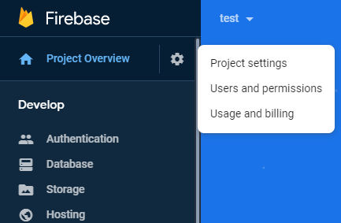

# Push Accounts

Accounts are push notification providers that can be used to send your notifications. To be able to send push notifications, you will need to register user devices from your client app. Based on the device token, an appropriate account will be used to send your notifications.

## Supported providers

Currently, we support the following providers. Instructions on how to setup each provider are shown below.

* [Firebase Cloud Messaging \(FCM\)](https://firebase.google.com/docs/cloud-messaging) - Google's free solution for push notifications.
* Apple Push Notifications \(APNS\) - Apple's free solution for push notifications.
* [One Signal](https://onesignal.com)
* [Expo](https://docs.expo.io/guides/push-notifications/)

### Firebase Cloud Messaging

To use FCM service you will need to create a Firebase project.

* Got to this link [https://firebase.google.com](https://firebase.google.com) and press "Go to console".
* Log in with your Google account.
* Once in the Firebase console, add a new project.
* Once the project is created, go to project settings.

Now if you are adding FCM as a provider in CodeMash follow 1\) steps. If you need FCM for other provider, follow 2\) steps.

#### 1\) Adding as a provider in CodeMash

* Once inside project settings select **Service Accounts** tab and here press on **Generate new private key** button.
* You will download a JSON file. Open it, copy all of its contents and paste into CodeMash.

#### 2\) Using for other providers \(One Signal\)

* Once inside project settings select **Cloud Messaging** tab. Here you will see project credentials.
* Copy **Server key** and **Sender ID** and paste into them into the required location by other provider.

This will allow you to push notifications Android devices. To enable sending to iOS devices additional configuration is required.

...

### Apple Push Notifications

### One Signal

To add One Signal account you will need to sign up at One Signal and get an API key.

* Go to this [link](https://app.onesignal.com/signup) and sign up.
* After you have created your account and logged in, add a new app.
* Set app name \(can be any name\) and select iOS or Android platform \(all platforms can be configured later\). Your app will be created now \(you can close all the pop ups now to configure a platform or you can continue to the next steps\).

After you have created an app, you will have to configure your platforms.

* Navigate to Settings &gt; Platforms and select a provider.
  * **Android** - you will need a server key and sender ID. For those, you will need to create Firebase project. How to get those check Firebase Cloud Messaging setup \(section above\).
  * **iOS** - you will have to generate and upload a production certificate that can only be done from Mac device. How to do this, check the Apple Push Notifications setup \(section above\).

Finally, add your One Signal App ID and Api key to CodeMash.

* Navigate to Settings &gt; Keys & IDs.
* Copy both App ID and App key and paste into CodeMash.

### Expo push notifications

If you are developing your application using expo, you can use expo push notifications \(app setup guide [here](https://docs.expo.io/guides/push-notifications/)\). All you have to do is get the user's device token and register the device in CodeMash \(check [devices ](devices.md)section\). There are no additional tokens that you have to register inside CodeMash.

