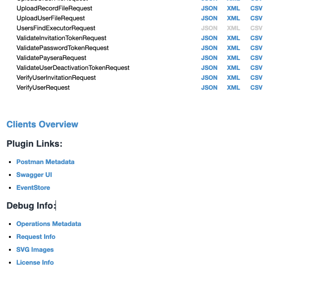
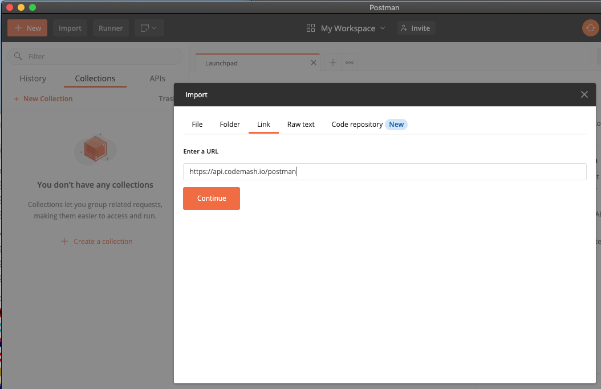
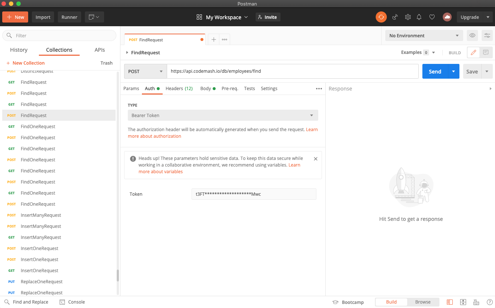

# API & SDKs

## API

Discover our API at [https://api.codemash.io/metadata](https://api.codemash.io/metadata)

All of the API requests takes in a version parameter. Developing CodeMash further may require us to change how requests are processed. To avoid breaking older functionality we introduced version parameters.

The following table displays currently available API method versions.

| Version | Available since |
| :--- | :--- |
| v1 | 2019-10-21 |
| v2 | 2020-05-18 |

## API & Postman Client

If you are working with the [Postman Client](https://www.postman.com/product/api-client/) tool to send requests, inspect the response, and easily debug your API, you can do so with CodeMash API as well. Go ahead to [https://api.codemash.io/metadata](https://api.codemash.io/metadata) and scroll down until you see the **Plugins** section as shown below.

Press **Postman Metadata** link. It will refer you to the page [https://api.codemash.io/postman](https://api.codemash.io/postman) that is filled in with metadata required by Postman. On the **Postman Client** side, press the **Import** button on the left upper corner, press tab **Link,** and enter [https://api.codemash.io/postman](https://api.codemash.io/postman) URL. 

When API collection is imported now you can test each REST API action separately.

## SDKs

The database and other services we do provide has REST API on top of it. So each interaction and much more are available using our robust API. Even though, work with API can be less joyful, than having a well-prepared SDK \(Software Development Kit\) for your programming language. For such reason, we provide ready to production SDKs that allows you to handle your tedious tasks very quickly and focus more on your app.

Currently, we do support:

* [Javascript SDK](https://github.com/codemash-io/CodeMash.Js) - [npm package](https://www.npmjs.com/package/codemash) which can be used in your front-end frameworks or libraries like [React](https://reactjs.org/), [React Native](https://reactnative.dev/), [Vue.js](https://vuejs.org/), [Angular Js.](https://angularjs.org/)
* [.NET Core SDK](https://github.com/codemash-io/CodeMash.Net) - [NuGet package](https://www.nuget.org/packages/CodeMash.Core/) allows you to connect [.NET Core, ASP .NET Core apps](https://dotnet.microsoft.com/) to CodeMash
* [Flutter](https://flutter.dev/) - In progress
* [Swift](https://developer.apple.com/swift/) - Planning
* [Android](https://www.android.com/) - Planning

